<div align="center">
  
  <!-- dynamic typing effect 动态打字效果 -->
  <div align="center">
    <a href="https://blog.sunguoqi.com/">
      
    </a>
  </div>

  <!-- knock code pictures 敲代码的图片 -->
  <br>

  <!-- profile logo 个人资料徽标 -->
  <div align="center">
    <a href="https://blog.sunguoqi.com/"></a>&emsp;
    <a href="https://twitter.com/sun0225SUN/"></a>&emsp;
    <a href="https://www.youtube.com/@sun0225SUN"></a>&emsp;
    <a href="https://box.sunguoqi.com/weixin_mp"></a>&emsp;
    <a href="https://space.bilibili.com/448488855/"></a>&emsp;
    <a href="https://blog.csdn.net/weixin_50915462/"></a>&emsp;
    <a href="https://www.zhihu.com/people/sunguoqi/"></a>&emsp;
    <!-- visitor statistics logo 访客数统计徽标 -->
    
  </div>

  <!-- Snake Code Contribution Map 贪吃蛇代码贡献图 -->
<picture>
  <source media="(prefers-color-scheme: dark)" srcset="https://cdn.jsdelivr.net/gh/sun0225SUN/sun0225SUN/profile-snake-contrib/github-contribution-grid-snake-dark.svg" />
  <source media="(prefers-color-scheme: light)" srcset="https://cdn.jsdelivr.net/gh/sun0225SUN/sun0225SUN/profile-snake-contrib/github-contribution-grid-snake.svg" />
  
</picture>
</div>

<table>
  
<tr><td>

<!--START_SECTION:waka-->
**I'm an Early 🐤** 

```text
🌞 Morning                272 commits         █████░░░░░░░░░░░░░░░░░░░░   19.33 % 
🌆 Daytime                447 commits         ████████░░░░░░░░░░░░░░░░░   31.77 % 
🌃 Evening                502 commits         █████████░░░░░░░░░░░░░░░░   35.68 % 
🌙 Night                  186 commits         ███░░░░░░░░░░░░░░░░░░░░░░   13.22 % 
```
📅 **I'm Most Productive on Friday** 

```text
Monday                   207 commits         ████░░░░░░░░░░░░░░░░░░░░░   14.71 % 
Tuesday                  182 commits         ███░░░░░░░░░░░░░░░░░░░░░░   12.94 % 
Wednesday                181 commits         ███░░░░░░░░░░░░░░░░░░░░░░   12.86 % 
Thursday                 143 commits         ███░░░░░░░░░░░░░░░░░░░░░░   10.16 % 
Friday                   398 commits         ███████░░░░░░░░░░░░░░░░░░   28.29 % 
Saturday                 151 commits         ███░░░░░░░░░░░░░░░░░░░░░░   10.73 % 
Sunday                   145 commits         ███░░░░░░░░░░░░░░░░░░░░░░   10.31 % 
```


📊 **This Week I Spent My Time On** 

```text
🕑︎ Time Zone: Asia/Shanghai

💬 Programming Languages: 
Markdown                 1 hr 58 mins        ████░░░░░░░░░░░░░░░░░░░░░   17.99 % 
Vue.js                   1 hr 44 mins        ████░░░░░░░░░░░░░░░░░░░░░   15.94 % 
JavaScript               1 hr 41 mins        ████░░░░░░░░░░░░░░░░░░░░░   15.46 % 
CSS                      1 hr 21 mins        ███░░░░░░░░░░░░░░░░░░░░░░   12.40 % 
YAML                     1 hr 17 mins        ███░░░░░░░░░░░░░░░░░░░░░░   11.78 % 

🔥 Editors: 
VS Code                  8 hrs 49 mins       ████████████████████░░░░░   80.59 % 
IntelliJ                 1 hr 42 mins        ████░░░░░░░░░░░░░░░░░░░░░   15.60 % 
Obsidian                 25 mins             █░░░░░░░░░░░░░░░░░░░░░░░░   03.81 % 

💻 Operating System: 
Windows                  10 hrs 9 mins       ███████████████████████░░   92.84 % 
Mac                      47 mins             ██░░░░░░░░░░░░░░░░░░░░░░░   07.16 % 
```


 Last Updated on 05/07/2023 01:50:40 UTC
<!--END_SECTION:waka-->
  
</td></tr>
</table>

<!-- ########################################## 分割 ########################################## -->


<div align="center" >



<!--  skill badge 技能徽章 -->

```mermaid
mindmap
  root((小李同学))
    编程
      Web开发
      网络爬虫
      人工智能
    摄影
      人文
      建筑
      风景
    旅行
      济南
      潍坊
      昌邑
      塔耳埠
    阅读
      人物传记
      个人成长
      社会文化
      心理
      计算机技术
```

💪 正在学习


  
🧠 计划学习


🧰 常用的工具


<!-- programming tool icon 编程工具图标 -->
<br>

<!-- svg -->


 


<br>

<!-- gif -->


<!-- just img 图片 -->
</div>

<!-- profile-3d-contrib 3D贡献图-->

</div>

<!-- ########################################## 分割 ########################################## -->


<div align="center" >

<!-- Github-Stats-Terminal 终端风格信息 -->
<br>
  
<!-- Quotes 名人名言 -->
<br>
  
<!-- GitHub 奖杯🏆 -->
<br>

<!-- GitHub 数据统计 -->

<br><br>

<!-- Awesome repo 比较好的仓库-->
<a href="https://github.com/sun0225SUN/Awesome-Love-Code">
</a>
<a href="https://github.com/sun0225SUN/Student-Data-Vision">
</a><br><br>
  
<!-- Wakatime Graph-->
<table>
  <tr>
    <td></td>
    <td></td>
  </tr>
  <tr>
    <td colspan="2"><a href="https://run.sunguoqi.com"></a><br></td>
  </tr>
</table>
</div>

<!-- ########################################## 分割 ########################################## -->


<div align="center">

<!-- run 图片 -->


<!-- Joke 笑话 -->
<div></div>

<!-- github-readme-streak-stats 连续提交代码天数记录 -->
&emsp;

&emsp;

<!-- Spotify 音乐 -->
<!-- &emsp;&emsp;&emsp;&emsp;

  &emsp;&emsp;&emsp;&emsp; -->

<!-- metrics 基础资料 -->
&emsp;

&emsp;

<!-- My Blog 博客首页 -->
&emsp;
<a href="https://blog.sunguoqi.com"></a>
&emsp;

<!-- GitHub Activity Graph GitHub 活动图 -->
<table align="center">
  <tr>
    <td></td>
  </tr>
</table>

</div>

<!-- ########################################## 分割 ########################################## -->


<!-- GitHub metrics 信息指标 -->
<div align="center">

<!-- just img 图片 -->


<!-- first form 第一个表格 -->
<table>
  <tr>
    <td></td>
  </tr>
</table>

<!-- second form 第二个表格 -->
<table>
  <tr>
    <td></td>
    <td></td>
  </tr>
  <tr>
    <td></td>
    <td></td>
  </tr>
  <tr>
    <td></td>
    <td></td>
  </tr>
  <tr>
    <td></td>
    <td></td>
  </tr>
  <tr>
    <td></td>
    <td></td>
  </tr>
  <tr>
    <td></td>
    <td></td>
  </tr>
  <tr>
    <td></td>
    <td></td>
  </tr>
</table>


<!-- just img 图片 -->

</div>
